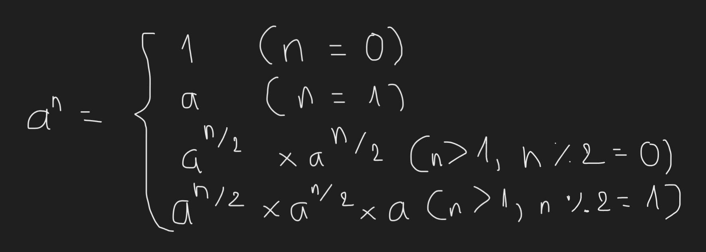
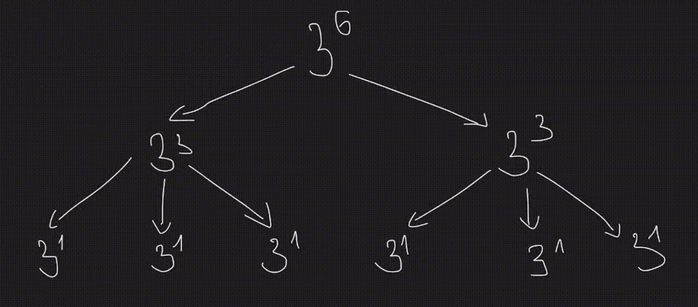

Với bài toán có thể đẩy lên tính a^n (1 <= a, n <= 10^9), thì việc tính vòng lặp như hình trước là không thể, theo lý thuyết, ta phải trải qua 10^9 bước tính và sẽ có độ phức tạp là O(10^9) (trong lập trình thi đấu, với giới hạn thời gian là 2 giây thì chỉ có thể xử lí loanh quanh O(5 * 10^6)), vì thế ta có cách tính khác thông qua tên gọi binary exponentiation (hay còn gọi là lũy thừa nhị phân), trong cuốn "Tài liệu giáo khoa chuyên Tin - quyển 1", ta có thể bắt gặp thuật toán này trong phần "Chia để trị".

Thuật toán được giải thích như sau:
với bài toán a^n, ta có thể chia bài toán này ra làm 4 trường hợp:
- Với n = 0, trả về giá trị 1.
- Với n = 1, trả về giá trị a.
- Với n > 1 và n là số chẵn, đệ quy tới bài toán a^(n / 2) * a^(n / 2).
- Với n > 1 và n là số lẻ, đệ quy tới bài toán a^(n / 2) * a^(n / 2) * a.

* Lưu ý là phép chia / ở đây là div, nên ở trường hợp 4, giả sử 5 div 2 = 2, khi cộng lại thì 5 div 2 + 5 div 2 = 4, do đó ta phải cộng thêm 1 vào, đó là lí do tại sao ở trường hợp cuối, ta phải nhân thêm a nữa.

	

Ở ví dụ trong hình, 3^6 bị chia thành 3^(6 div 2) * 3^(6 div 2) = 3^3 * 3^3, tương tự với các mũ thấp hơn theo công thức mình vừa nêu ở hình trước.

	

Lưu ý, vì các số nhân nhau có thể dẫn đến việc overflow (tràn biến) nên chúng ta dùng thêm đồng dư thức, tóm tắt như sau:

Với (a * b) % n, ta có thể viết lại thành ((a % n) * (b % n)) % n.

Ví dụ:
- Với phép tính (11 * 7) % 5, nếu ta tính thẳng thì ta được như sau:
(11 * 7) % 5
= 77 % 5
= 2

Với đồng dư thức, ta có thể viết lại thành
(11 * 7) % 5
= ((11 % 5) * (7 % 5)) % 5
= (1 * 2) % 5
= 2 % 5
= 5

Mục đích của việc sử dụng đồng dư thức là làm cho kết quả a * b không bị tràn biến và ra kết quả sai khi chia dư. Với ưu điểm là chia nhỏ bài toán ra, độ phức tập thuật toán cuối cùng theo lý thuyết sẽ là O(logn) (với log ở đây là log cơ số 2, các bạn nên chú ý điều này) với n là số mũ của lũy thừa. Vậy với n = 10^9 (trường hợp tệ nhất) thì độ phức tạp sẽ là O(log(10^9)) ~ O(30) !!!